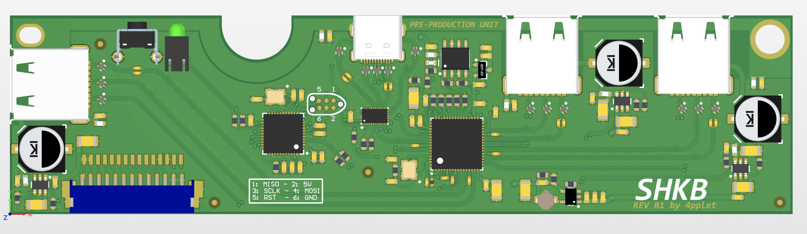

# SHKB
A alternative controller for the HHKB with integrated SuperSpeed 5.0 Gbps USB 3.1 Hub.

## Status:
- Prototype round 2 of Rev A. PCB produced and delivered to testers, currently 5 PCB's being used, two HHKB JP, three regular ANSI. So far working great.
- 2021-03-16: New proto-run being made with some changed components better suited for manufacturing and connectors that better fits custom projects.

## **Note:**
- **Rev B is still not test-mounted in case. Compatibility with port placement is not yet tested**

## Some features:
- 3 available USB3 ports, two external, one internal. Hub: TUSB8042A
- ATMEGA32U4 for keyboard firmware (TMK/QMK/VIA), uses current implementations for HHKB
- 900mA per port current limit on each downstream port using TPS2552D
- Will need modification of hhkb case because of the usb-c connector

## Altium view of PCB

Thread on GH: https://geekhack.org/index.php?topic=93970.0

## Future work
- Perfect USB-port placement
