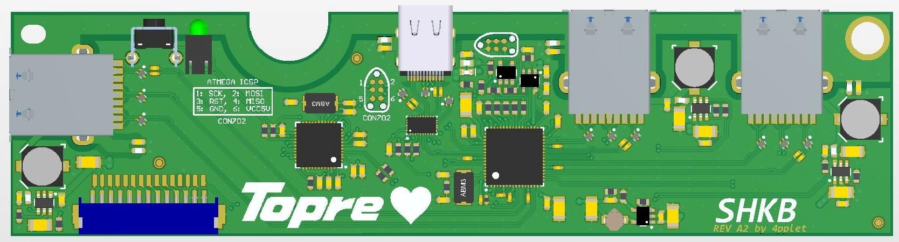

# SHKB
A alternative controller for the HHKB with integrated USB3-hub.

## Status:
Prototype round 2. PCB produced and delivered. Need to order components and populate one board for testing.

## Some features:
- 3 available USB3 ports, two external, one internal. Hub: TUSB8042
- ATMEGA32U4 for keyboard firmware (TMK/QMK)
- 900mA per port current limit on each downstream port using TPS2552D
- Will need modification of hhkb case because of the usb-c connector

## Teaser: 

Thread on GH: https://geekhack.org/index.php?topic=93970.0
