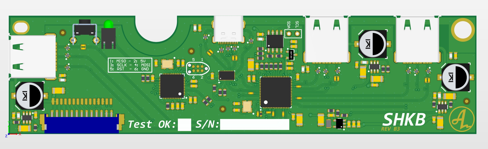
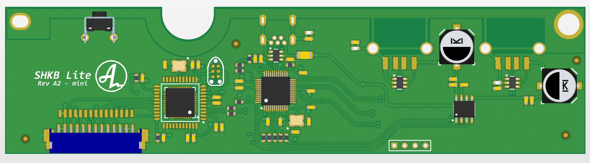
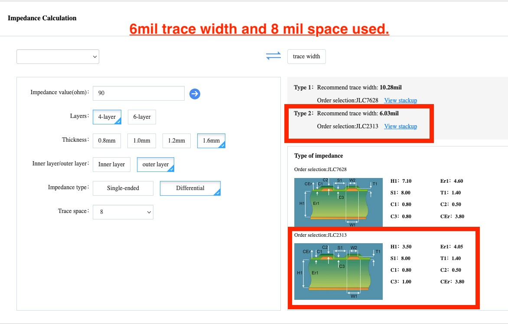
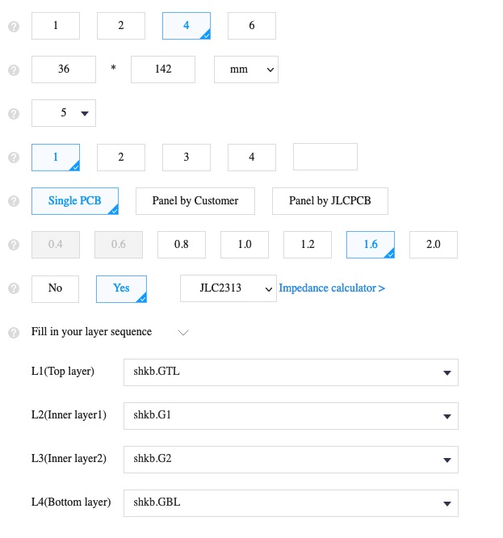
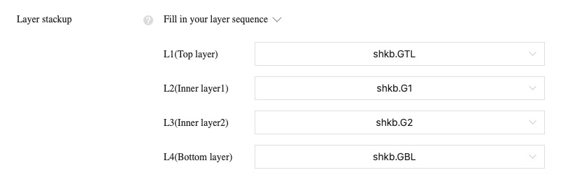

# SHKB
A alternative controller for the HHKB pro 2 with integrated hub. The full-version features a SuperSpeed 5.0 Gbps USB 3.1 Hub, the lite-version features a USB 2.0 MTT hub. The lite-version is available in USB-mini as a drop in replacement for the OG controller. For the full version to fit in a HHKB Pro 2 plastic case, the opening for the USB-port needs slight modification for the USB-C port.

Thread on GH: https://geekhack.org/index.php?topic=93970.0

## Status - Full (USB3.1):
- Prototype round 2 of Rev A. PCB produced and delivered to testers, currently 5 PCB's being used, two HHKB JP, three regular ANSI. So far working great.
- 2021-03-16: New proto-run being made with some changed components better suited for manufacturing and connectors that better fits custom projects.
- 2021-06-29: New proto-run being made with fixed issues on the USB-A connectors introduced in revision B1. Minor trace-tweaks and a new inductor for the 1.1v regulator.

## **Note - Full (USB3.1):**
- **Rev B is a work in progress. Base functionality is tested. Need to do long term testing and verify USB 3.0 speeds and reliability.** But it seems to work properly. Some compatibility issues with cables and usb-docks have been reported. I will look into this.

## Features - Full (USB3.1):
- 3 available USB3 ports, two external, one internal. Hub: TUSB8042A
- ATMEGA32U4 for keyboard firmware (TMK/QMK/VIA), uses current implementations for HHKB
- 900mA per port current limit on each downstream port using TPS2552D
- Will require modification of hhkb case because of the usb-c connector

## PCB

## Future work Full (USB3.1)
- Fully test and verify revision B3.

## Status - Lite (USB 2.0):
- 2022-03-16: Initial prototype round ordered for mini-version. Tested and one bug found. 
- 2022-04-10: Issue in A1 have been fixed and A2 files have been released. Patch done in A2 have been tested on A1 prototypes.

## Features - Lite (USB 2.0):
- 2 external USB2 ports, one internal. The internal port is unprotected, so use with care. HUB: FE1.1
- ATMEGA32U4 for keyboard firmware (TMK/QMK/VIA), uses current implementations for HHKB
- Per port current limit on each downstream port using MIC2026-2
- Drop-in replacement for the OG controller

## PCB

## Build guide SHKB Full
The SHKB Full is designed with production at JLC in mind. This was much easier and more realistic when the project began, but with the current silicon shortage, it's next to impossible to get these made at a resonable cost, and many parts is out of stock at JLC.

The PCB is designed to use this build up:

The PCB is designed with some specific specs in mind:

When placing an order, you'll need to specify the layer stackup, enter the layers in this order:

When having the PCBs produced, you'll also need to flash the on board EEPROM. I have prepared a config that works well in the EEPROM config folder in this repo. This can be flashed either using a external programmer or use the "TUSB80xx_EEPROM_Programmer". I am not allowed to share this software, but you can usually get access to it if you ask their support or ask in their forum. The config provided as a .txt can be directly loaded into the TI software and the EEPROM can be flashed without the use of a external programmer.

## Build guide SHKB Lite
The lite version can more or less be ordered from JLC. I designed this with cost and ease of manufacturing as my main gooals. However, there is usually parts out of stock and for example, the JST connector used to connect the controller to the main HHKB PCB is often out of stock. You'll need to source it from some other supplier and solder it yourself, alternatively use some other manufacturer that can source all the componentes needed (like PCBWay, electrow etc).

<a href='https://ko-fi.com/4pplet' target='_blank'>